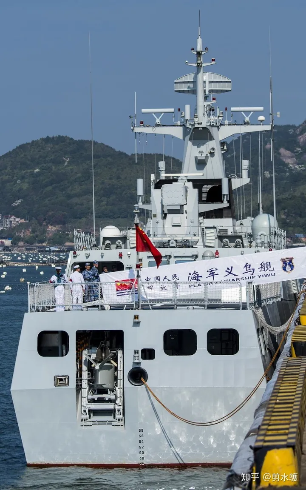

# 水声信号典型传播路径

转载自 知乎 [水声信号典型传播路径](https://zhuanlan.zhihu.com/p/41255768) 作者 [剪水鹱](https://www.zhihu.com/people/wang-xiao-hui-50-34)

声音在海水中传播的速度受到温度，压强，含盐量三方面因素的影响。水温每上升 1 摄氏度，声音的传播速度增加 3 米/秒。压强每提高 1 个大气压 (深度增大 10 米)，声音传播速度加快 0.17 米/秒。1/1000 的含盐量增长对应 1.3 米/秒的额外声速。在温度，压强，含盐量三重因素共同作用下，开阔海域水体中声音传播的速度与水深存在上图所示的对应关系 (盐度大致恒定，压强随深度增加线性增长，由于得到阳光加热，中低纬度海域表层水体的温度通常显著高于其下水层，至较深处水温逐步趋向恒定)。

表层海水平均盐度。

传播速度的差异导致了水声信号的折射，即传递路径向声速较低的方向弯折。

温度跃变层 (水温在该层内迅速下降至接近深海区恒定值) 之下声速随水深稳步增长，水声信号的传播路径相应向浅水方向弯折，深海水体起到虚拟凸透镜的会聚作用，将分散的声学信号逐步汇集至宽数海里，深度数百米的狭小 (相对而言) 区域内，此即所谓水声会聚区 (Convergence Zone CZ)。

水声会聚区的间隔受海洋环境影响而无一定之规，但在北大西洋和北太平洋 (海军强国扎堆之处) 通常为 30-35 海里，宽度则随与声源的距离增加而逐步变大。舵效航速 (3-4 节) 下 (保证基本航向及配平控制能力，最大限度降低平台自噪音和声纳阵列流体噪音) 部署的低频被动拖曳线列阵往往能探测到在第三水声会聚区 (即大约 100 海里之外) 高速航行的水面战舰和潜艇。

水声会聚区的同心圆分布模式意味着近距离上 (但不在水声会聚区内) 的声源可能比远处位于水声会聚区内者更难以探测，为被动探测能力领先的平台提供了巨大的战术优势 (譬如首先低速航行通过水声会聚区 & 确定对方位置，航向，航速，随后利用两个水声会聚区之间的盲区高速接敌)。海域深度不足时水声会聚区无法形成。海长矛潜潜导弹的常规战斗部 (先进轻鱼) 版射程 35 海里，恰与第一水声会聚区重合，由于定位精度无法保证，攻击更远处 (第二，第三水声会聚区) 目标时必须使用杀伤半径巨大 (10 千米级) 的 W89 (20 万吨 TNT 当量) 热核战斗部。

海水对声学信号的吸收强度随频率增加而上升。图中横坐标为频率 (千赫)，纵坐标为吸收系数 (分贝/米)。因此远距探测只能依赖低频声纳。现代化潜艇的安静性日益改善则迫使低频声纳从纯被动转向主被动复合，以增大水面战舰执行反潜任务时的暴露概率为代价重建有效的远程对潜探测能力。

造价低廉的 056A 反潜轻护说白了就是用来当炮灰的。

声学信号在介质中传播时，路径向速度较低方向弯曲。海洋声速低谷水层因此形成了事实上的声学波导通道，即所谓 Deep Sound Channel DSC。以较小角度入射的声信号依靠折射现象与该波导通道耦合 (与光纤的工作原理一致)，能以极低损耗长距离传播 (仅限于能量不易被海水吸收的低频信号)。

声音在海水中传播的速度受到温度，压强，含盐量三方面因素的影响。水温每上升 1 摄氏度，声音的传播速度增加 3 米/秒。压强每提高 1 个大气压 (深度增大 10 米)，声音传播速度加快 0.17 米/秒。1/1000 的含盐量增长则对应着 1.3 米/秒的额外声速。高纬度海域表层温度远低于深海水温，声速低谷区的深度相应较浅，恰与绝大多数军用潜艇的典型活动深度契合。冷战时期美军 SOSUS Sound Surveillance System 声纳监视系统部署于 GIUK 拦截带海底山脉之上的大型水声监听站由是得以利用深海水声通道的波导效应，对游弋于 1000 海里外北冰洋海域的苏军核潜艇 (非静音型号 & 高速航行的静音潜艇) 实施有效监视。但苏军核潜艇的安静性从上世纪 70 年代起迅速改善，噪声水平在短短十几年中下降 30 分贝，冷战结束时 SOSUS 面对中低速航行的现代化苏军潜艇已形同虚设。美军因而将战略级大型低频主动声纳作为其研发重点。无力实施进攻性战略反潜行动的欧洲列强与东亚大国则把注意力集中在了战术级低频主动声纳之上。

美国海军 1989 年租用，2008 年退租的 Cory Chouest 号海洋测量船长 80.8 米，宽 18.3 米，由两台柴油机推进，最大航速 11 节。看上去很不起眼的 CC 是大型战略级低频主动声纳的技术验证平台，搭载了垂直布放的 42 吨宽频段发射阵列与长达 1600 米的大孔径宽频段接收阵列。

上图中虚线为极区海洋声速-深度曲线，实线为中低纬度海区声速-深度曲线，黑线为深海水声通道轴线。

上图中的虚线显示了深海水声通道轴线的深度随纬度而变化的情况，横轴为纬度，纵轴为水深，实线为水声等速线。

独苗一根的 685 号工程 K-278 共青团员号攻击型核潜艇下潜深度达 1000 米级，原则上可依靠大深度航行，避开 GIUK 拦截带及其北方海区的深海水声通道。

SSN-21 海狼级的下潜深度为美军攻击型核潜艇之冠。在北极海区捕猎苏军高价值核潜艇时，海狼可利用其深潜能力隐藏于(深度较浅的)北冰洋深海水声通道之下，而将高度灵敏度拖曳线列阵声纳部署在深海水声通道之内，倾听战略导弹潜艇和反舰巡航导弹潜艇发出的噪音 (SSBN 和 SSGN 武器载荷较大，耐压壳大型开口较多，下潜深度相应受到限制)。

重点讲解 CZ 与 DSC 后，简单介绍一下其它路径

1\. 北极冰盖下，声学信号遭到冰层不规则下表面散射，传播过程中损耗极大，冰下水域因此是核潜艇长期蛰伏的理想环境 (而且航空及水面反潜兵力皆鞭长莫及)。

2\. 海洋表层水声通道，当声速在水体表层达到最低值时存在。

声速从海面起随水深增加时，声信号因折射作用而被水体表层的波导通道捕获。

3\. 深海水声通道。

深海水声通道是超远程对潜探测的基础。

4\. 水声会聚区

水声会聚区的存在是开阔海域远程战术对潜探测能力的基本前提。

5\. 洋底反射

如果海底较为平坦，声信号不至遭到强烈散射，则水面战舰可选择以较大入射角向海底发射声纳波束，从而避开由折射效应导致的传播路径弯折，以海底为反射镜实现对较远处目标的有效探测。被动监听亦可使用该传播路径。洋底反射模式声纳的最大探测半径通常不超过 20 海里。

若放弃洋底反射模式，舰载中频声纳的覆盖半径通常在 10 海里以内。垂直发射版阿斯洛克 的最大射程即为 10 海里。武器射程必须与传感器性能相匹配，超过传感器有效覆盖的武器射程毫无意义。

6\. 浅海水域
由于水深不足，2-5 全部失效，声学信号在水面和海底之间连续反弹，迅速损耗 (非光滑界面导致水声能量的散射，此处尚未考虑浅海水域含盐量剧烈波动对水声信号传播的影响)，加之环境背景噪声异常强烈，以声学手段远程探潜事实上已成为不可能的任务。

由于高频声波随传播距离增加而迅速衰减，海洋背景噪声谱中的高频部分甚为微弱，低频部分则相当强烈 (横坐标为频率，单位为赫兹，纵坐标为噪声水平，单位为分贝)。图中两条棕色粗线界定了主要噪声的上限和下限，棕色虚线为交通繁忙海域的船舶噪声，灰色区为浅海海域船舶噪声的典型水平，其右侧的横线区为深海海域船舶噪声的典型水平，黑色实线及数字显示风级与风致噪声的对应关系，黑色长虚线为强降水导致的背景噪声，黑色短虚线为外推值 (非实测)。100-100000 赫兹频段由海洋表层激励噪声主导，船舶交通是 10-1000 赫兹背景噪声的主要来源。生物活动，降水，海冰，海洋油气开发，渔业活动等均可间隙性地在局部海域导致明显高于典型水平的宽频背景噪声。

开阔海域水声信号典型传播路径图解。

海水对声信号的折射作用意味着吊放式声纳的部署深度越大，信号覆盖 (黄色区) 就越彻底。
