# 水下声线

01. 定位，从扔球开始

　　在黑暗中，如果不用眼睛看，怎么才能知道前方是否有目标，目标又在哪个方向呢？

　　你可以尝试用“扔球法”：各个方向都扔一个球，如果球没有弹回来，说明（探测距离内）该方向没有目标。如果球弹回来，就说明该方向有目标。

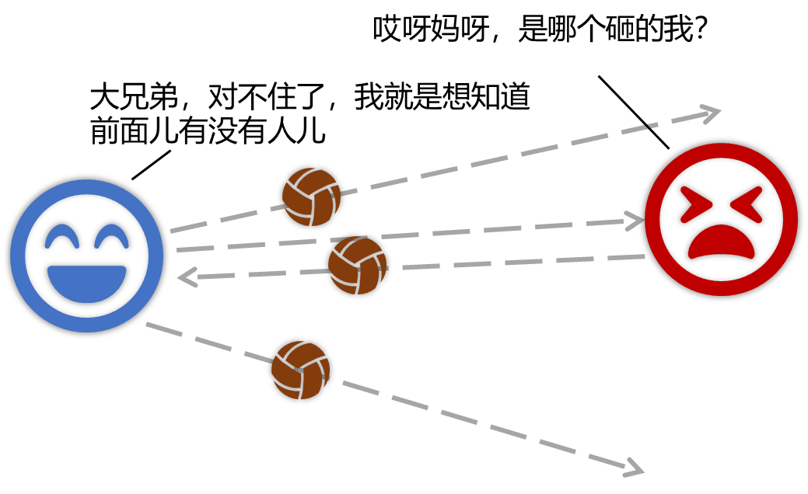
　　（图片来源：作者绘制）

　　又怎么才能确定目标在什么位置呢？

　　已知扔球的时间，以及球弹回来的时间，这个时延差就是双倍距离（球走一个来回）所用的时间，若已知球的速度，那么就可以确定目标的距离。结合目标的方向，就可以确定目标的位置。

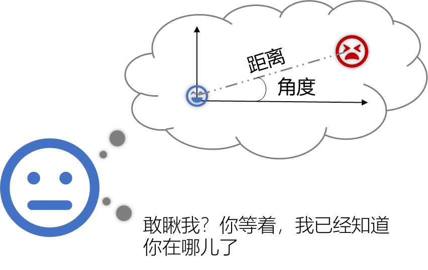
　　（图片来源：作者绘制）

　　在水下，最常见的“球”是声波（声纳），人们最初使用声纳时，认为声波是沿直线传播的。

　　02.探测，早晚“看”的不一样

　　上个世纪二三十年代，人们发现一个奇怪的现象：声纳探测器早上还能检测到远处的静止目标，一过中午，同一套设备对同一目标的探测性能就下降，甚至探不到了。

　　这种回声探测设备，每到下午性能就下降的现象，被称为午后效应（Afternoon Effect）。人们甚至一度怀疑是操作人员下午精神不集中，导致的操作失误。

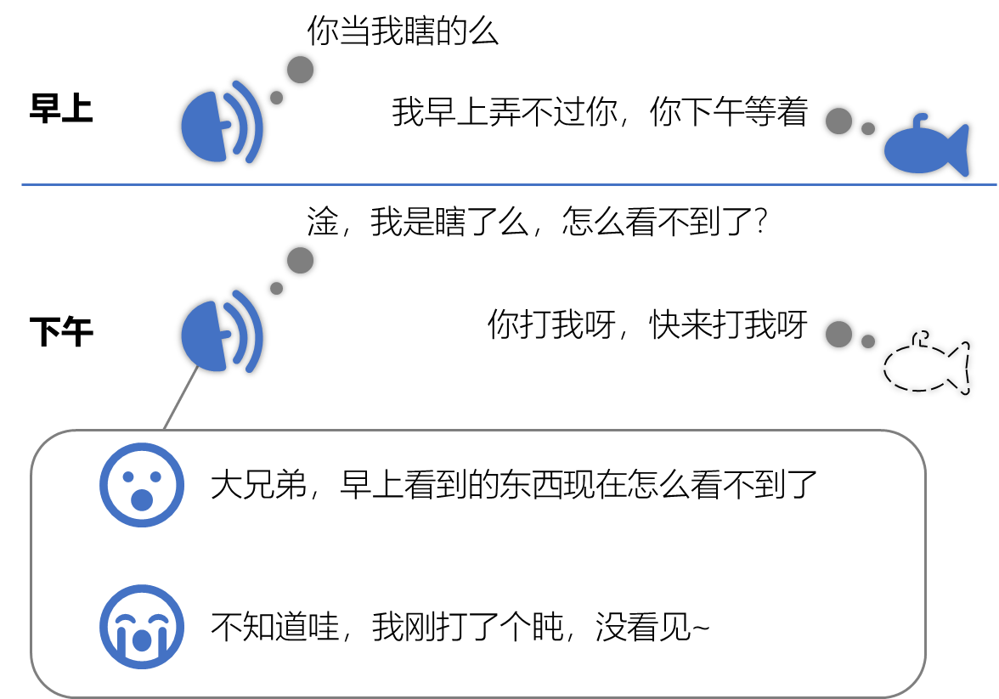
　　（图片来源：作者绘制）

　　另外，当人们沿着声纳测到的方向，去找目标时，即使是性能最好的早上，也总是有极大的误差。

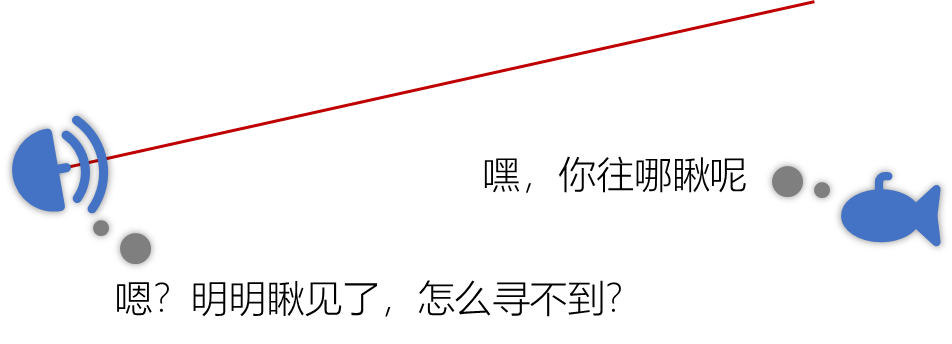
　　（图片来源：作者绘制）

　　后来，人们成功研制了深度温度计，发现海水的温度不是均匀分布的。例如在浅海区域，越靠近海面，温度越高。就这样，人们开始从海水中声波的传播特性上，研究“午后效应”背后的原因。

　　03.午后效应,声波原来会拐弯？

　　原来，以往认为声波沿直线传播，是建立在声速处处相等的前提下。而海水的温度变化，会使得不同深度的声速不同，产生声速分布（Sound Velocity Profile），往往认为海水符合分层介质模型，即海水可被分为多个水平层，同一水平层内声速相同。

　　经典的分层介质模型中，对于浅海最常见声速分布的是负梯度（Negative Gradient）模型，即深度越大，声速越小。

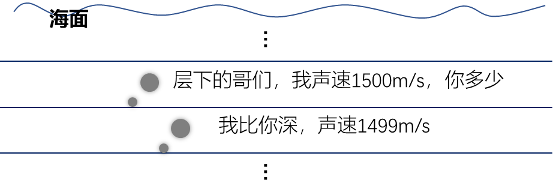
　　（图片来源：作者绘制）

　　虽然一直都在海水中，但声波从一种声速层传播至另一种声速层时，会发生折射（Refraction）现象。而且折射的规律与光从空气传播至水中相同，均满足Snell折射定律（Law of Refraction）。（声波和电磁波的差异巨大，这里仅指折射定律）

　　大家可以回忆一下在水面“折了”的筷子，就是由于光在空气中的传播速度高（疏介质，Thinner Medium），而在于水中的传播速度低（密介质，Denser Medium）。

　　不断的折射造成声波在水中不是沿直线传播，而是一条曲线。类似于用光线表示用光波的传播轨迹，我们往往用声线（Sound Ray）表示声波的传播轨迹。而根据Snell折射定律，可以证明：声波总是弯向声速减小的方向。

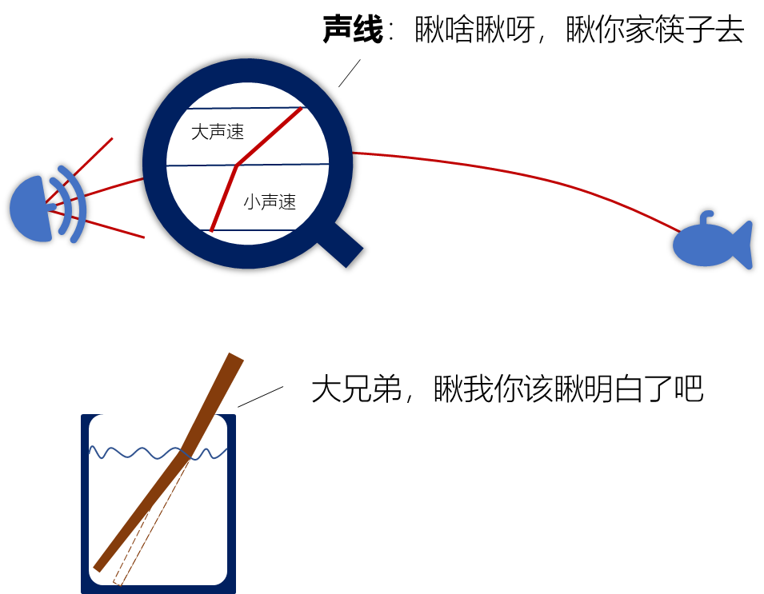
　　（图片来源：作者绘制）

　　这也就解释了，为什么沿着声纳“看”到的方向去找目标，总是有很大的误差（人家声线明明走的是曲线，你非得按直线找，误差小算我输）。

　　在对海水声速分布进一步研究后，人们发现，声速不仅和温度有关，还和压强、盐度等因素有密切关系。同时，负梯度声速分布往往只出现在浅海区域，完整海洋中最常见的声速分布曲线如下图

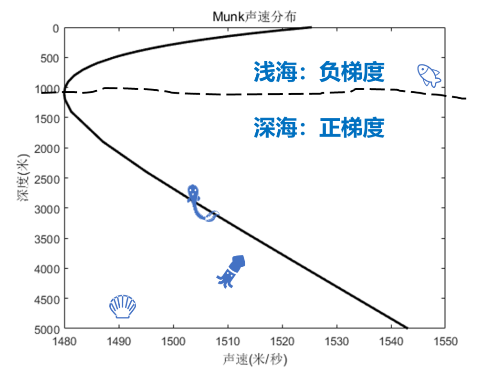
　　西太平洋附近声速分布模型（图片来源：作者绘制）

　　04.声影区，变化的声纳盲区

　　我们将不经过任何反射的弯曲声线称为直达声线（Direct Sound Ray）。在浅海中，由于海面的存在，直达声线的传播空间是有界的，因此存在一个与海面恰好相切的临界声线（Critical Sound Ray）。

　　在临界声线区域内的目标，声纳总有声线可以探测到，而这个区域外的目标，声线不经过反射就永远探测不到。这就像人的盲区一样（除非有个镜子反射视线，不然看不到杯子后面的钥匙），这个区域被称为声影区（Acoustic Shadow Zone）。

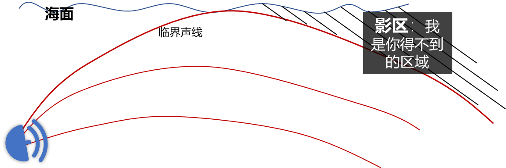
　　（图片来源：作者绘制）

　　声影区的范围，主要是由声纳的位置以及声速分布决定。若声纳位置固定，当声速分布改变，声影区的范围也将随之改变。

　　回到“午后效应”：早上的海水温度较低，声速符合负梯度分布，只要目标没有在声影区，就总有声线可以探测到。而中午过后，由于海面一直受到太阳辐射，因此温度升高，声速分布改变，甚至可能变成正梯度（Positive Gradient）分布。

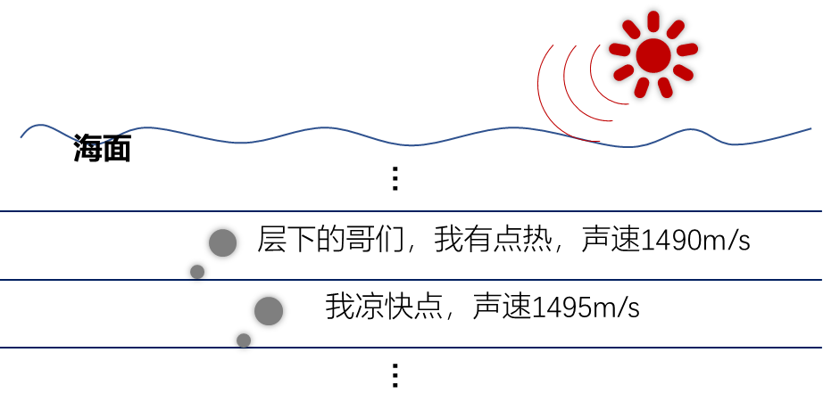
　　（图片来源：作者绘制）

　　声速分布的改变将导致声影区的改变，早上未落入声影区、可以探测到的目标，下午便可能落入新的声速分布下的声影区。

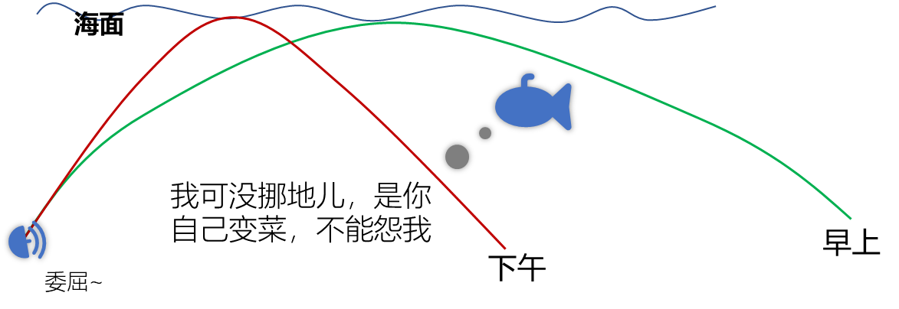
　　（图片来源：作者绘制）

　　这也就解释了“午后效应”：由于海水声速分布的改变，导致早上能探测到的目标，下午却落入了声影区，因此信号显著减弱，甚至完全消失。

　　05.应用：全新的目标定位

　　我们知道了海水中声速不是恒定的，因此声线是弯曲的，根据声波的传播特性（Propagation Property），就可以进行全新的目标定位。发现规律，修正规律，利用规律，人类的科技就是这样迭代更新的。但这时，仍需要注意以下几点。

　　（1）声影区目标的探测

　　我们知道了直达声线的传播特性，但当目标处于声影区时，依旧无法探测。这时，就可以利用反射声线（Reflected Sound Ray）对目标进行探测。

　　声线在海水中的传播，往往是有界的，最常见的界面是海面、海底。虽然直达声线无法到达声影区，但界面反射后的声线却可以。

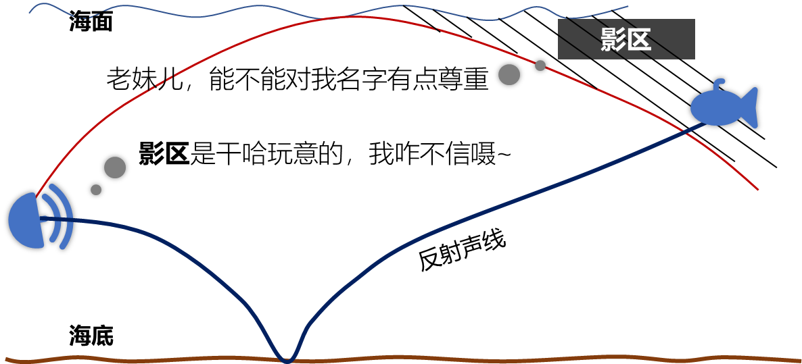
　　（图片来源：作者绘制）

　　虽然反射声线能够探到目标，但由于其受到界面影响、传播路程也较长，其性能不太稳定。因此影区目标的定位，依旧需要进一步的发展。

　　（2）运动目标的探测

　　回顾“扔球法”探测目标。实际上，由于环境噪声（Environmental Noise）的存在，弹回来是一堆球，且并不能直接看出球是什么时候回来的。这时，我们是通过观测接收到的球，看哪一时刻的球最像“扔出去”的球，即认为是传播时间。

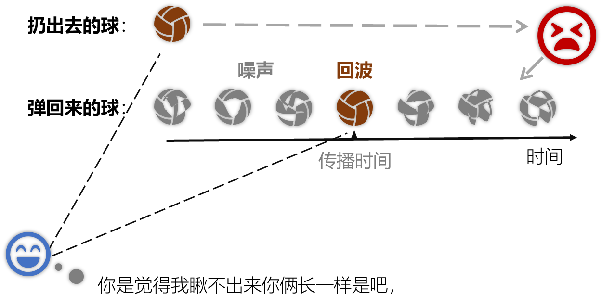
　　（图片来源：作者绘制）

　　然而，如果目标是运动的，由于多普勒效应（Doppler Effect）的存在，回波的波形会发生拉伸或压缩，导致变形，从而找不到“最像”的球，即搜索不到传播时间。

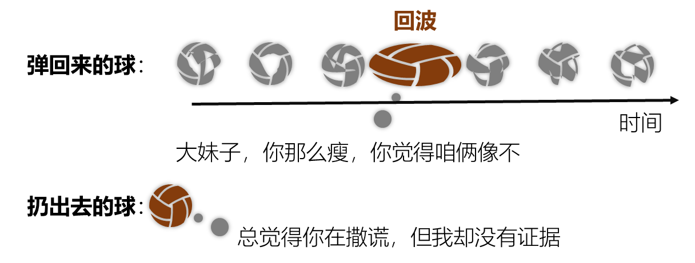
　　（图片来源：作者绘制）

　　这时，我们往往猜测目标可能的速度，根据速度将“扔出去”的球做几组不同的拉伸，然后分别“找最像”。这样，技能确定传播时间，还能确定目标的速度（决定了拉伸程度）。

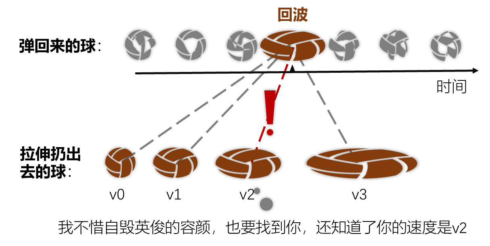
　　（图片来源：作者绘制）

　　“找最像”的操作叫做互相关（Cross Correlation）， “拉伸”的操作叫做频率补偿（Frequency Compensation），整个过程叫做脉冲压缩（Pulse Compression）或者匹配滤波（Matched Filtering）。

　　这种方法是针对无折射、直线传播的信号提出的，但依旧适用于水下有折射、弯曲传播的声信号，这是由于折射不改变信号频率。这类似于，红（频率低）筷子插到水里，不能变成紫（频率高）筷子。

　　最后，给出上面提到的西太平洋海域完整声速分布的声线图。图中一条条的曲线就是直达声线和反射声线，而没有声线的空白区域，就是声影区。

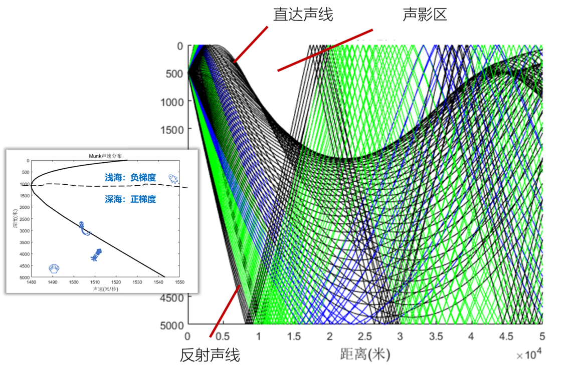
　　西太平洋附近声线图 （图片来源：作者绘制）

参考文献

- 刘伯胜, 雷家煜. 水声学原理\[第二版\](M). 哈尔滨: 哈尔滨工程大学出版社.
- 望墨溢（西北工业大学航海学院）.水下的声波：我坦白，我是弯的.科普中国.2020
